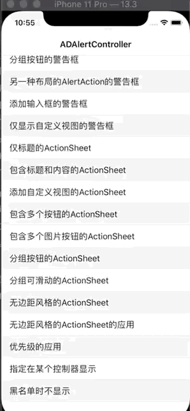

## 说明

`ADAlertController` 是一个与` UIAlertController` 类似风格的 UI 控件,包含 `Alert` 和 `ActionSheet` 以及`无边距的 ActionSheet(ADAlertControllerStyleSheet)` 等 UI类型.与`UIAlertController` 有相似的 API.支持 iOS9+.并支持以下扩展功能:

- 支持添加自定义视图元素
- 多种`AlertAction`可供选择,并容易扩展实现新的 `AlertAction` UI样式
- 支持优先级队列,在优先级队列里可配置以下功能
  - 支持仅在某些特定的控制器上显示
  - 支持设置黑名单

## 演示




## 安装

1. 使用`CocoaPods`:

   在`Podfile`中添加以下语句

   `pod ‘ADAlertController’`

2. 手动安装:

   下载仓库代码,将`ADAlertController`文件夹下所有的文件拖到你的项目工程中

   PS:`ADCustomAlertContentView`文件夹并非`ADAlertController`要求的源码,而是实现自定义内容视图的一点建议.若有其他更好的用法,欢迎提供意见.

**若在使用过程中有任何问题,欢迎提`Issue`**

## 使用

针对演示图片中的第一张图出现的第一个例子为例,初始化代码如下:

```objc
		ADAlertAction *cancelAction = [ADAlertAction actionWithTitle:@"取消" style:ADActionStyleCancel handler:^(__kindof ADAlertAction * _Nonnull action) {
        NSLog(@"点击了取消");
    }];
    
    ADAlertAction *sureAction = [ADAlertAction actionWithTitle:@"确定" style:ADActionStyleDefault handler:^(__kindof ADAlertAction * _Nonnull action) {
        NSLog(@"点击了确定");
    }];
    
    ADAlertController *alertView = [[ADAlertController alloc] initWithOptions:nil title:@"这里是标题" message:nil actions:@[cancelAction,sureAction]];
    [alertView show];
    
```


### 1.初始化

`ADAlertController`使用指定构造方法来生成实例:`-initWithOptions:title:message:actions:`.

- 第一个参数是`ADAlertControllerConfiguration`对象类型,可以为 nil.

  `ADAlertControllerConfiguration`用来配置一些 UI 样式.其中的`preferredStyle`属性就是来指定具体的 UI 样式,有以下几个枚举类型:

  - `ADAlertControllerStyleAlert`:与`UIAlertControllerStyleAlert`类似
  - `ADAlertControllerStyleActionSheet`:与`UIAlertControllerStyleActionSheet`类似
  - `ADAlertControllerStyleSheet`:与`UIAlertControllerStyleActionSheet`类似,只是左右以及底部的边距都是 0.

  `preferredStyle`属性一经初始化,不得更改.

  `ADAlertControllerConfiguration`使用指定构造方法`-initWithPreferredStyle:`

- 第二,第三个参数分别表示标题和内容信息,可为 nil.

- 第三个参数是包含的按钮,可为 nil.不同于`UIAlertController`的添加按钮方法,这里添加按钮采用数组的方式.

  对于`ADAlertControllerStyleAlert`类型,这个数组的内容就是警告框最终包含的按钮.

  对于`ADAlertControllerStyleActionSheet`和`ADAlertControllerStyleSheet`类型,若想添加取消按钮,不是将取消按钮放到最后一个,而是应该调用`-addActionSheetCancelAction:`来添加.

### 2.按钮的初始化

`ADAlertAction`是具体的按钮类,用来生成标题或者图片的按钮,标题或图片只能二选一显示,若同时配置二者,则优先显示标题.构造方法为`+ actionWithTitle:image:style:handler:configuration:`

其中`handler`为点击事件回调.`configuration`为 UI 配置相关.

若需要实现自己的按钮 UI 样式,可以参考`ADAlertImageAction`的实现.

另外还提供了两个`ADAlertAction`的子类:

- `ADAlertGroupAction`:可将多个`ADAlertAction`作为一个按钮添加,内部的各个按钮平分宽度
- `ADScrollableGroupAction`:`ADAlertGroupAction`的子类,当按钮个数多个时,可滑动显示

### 3.显示与隐藏

显示时可直接调用`-show`方法.想主动隐藏可以调用`-hiden`方法.若想触摸背景也自动隐藏,可以设置`ADAlertControllerConfiguration`的`hidenWhenTapBackground`属性为`YES`.

若想进入优先级队列,可以调用`-enqueue`

#### 4.设置自定义视图

设置`ADAertController`的`contentView`为你需要的`UIView`对象即可,需要自己设置高度约束.建议的方法为`[contentView.heightAnchor constraintEqualToConstant:100].active = YES`.

`ADAlertControllerStyleAlert`类型时,是显示在标题之上.

`ADAlertControllerStyleActionSheet`和`ADAlertControllerStyleSheet`类型时,显示在` message` 之下

具体用法可参考示例中的`ADAdvertView`和`ADPickerView`

### *5.alert类型添加 UITextField

当为`ADAlertControllerStyleAlert`类型时可以添加`textField`.具体参考示例中的”添加输入框的警告框”

**目前添加UITextField 暂未适配键盘遮挡问题**

### 6.优先级及优先级队列          

若需要显示多个`AlertController`又难以管理各个`AlertController`的显示顺序时,可以设置优先级属性`alertPriority`并调用入队列方法`-enqueue`.在内部有个优先级队列管理对象(`ADAlertControllerPriorityQueue`)会自动管理下一个将要显示的`AlertController`对象

使用优先级队列有以下注意点:

1. `alertPriority`是`NSUInteger`类型,虽只有三个枚举值,但可以设置任何有效的`NSUInteger`值.
2. 支持设置全局的黑名单.黑名单仅支持类型,不支持具体到某个控制器实例,具体参考示例中的"黑名单时不显示”
3. 支持设置`AlertController`仅针对某个目标控制器显示.具体参考示例中的"指定在某个控制器显示”


